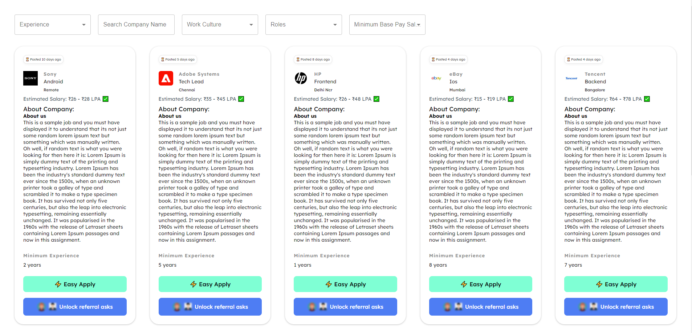

Skill Sync (https://skill-sync-red.vercel.app/)

Project Description: 

This project is a candidate application platform designed to allow users to view job listings, filter jobs based on various criteria, and implement infinite scroll for a seamless browsing experience. The platform provides a user-friendly interface for viewing and applying to jobs.

Getting Started:

Follow the instructions below to set up and run the project locally.

Prerequisites:

Node.js installed on your local machine

Installation:

Clone the repository to your local machine:
git clone https://github.com/DarkM4tt/SkillSync.git

Navigate to the project directory:

cd SkillSync

Install dependencies:

npm install

Running the Application:

Start the development server:
npm start

Open your web browser and navigate to localhost to view the application.
Or you can view the hosted project on https://skill-sync-red.vercel.app/

Filters:

You can filter job listings based on the following criteria:

Min experience,
Company name,
Location,
Remote/on-site,
Tech stack,
Role,
Min base pay

Infinite Scroll:

The platform implements infinite scroll to load additional job listings as the user scrolls down the page. More jobs will be fetched and displayed automatically.

Responsive Design:

The platform is responsive and works well on different screen sizes, including mobile devices.

API Integration:

The project integrates with the provided API to fetch job listings and their details.

For any questions or clarifications, feel free to contact the developer:

Email: prabhat.dev933@gmail.com